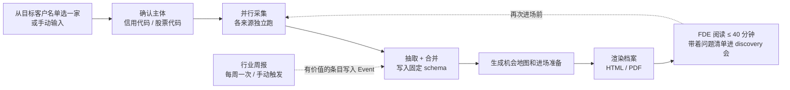
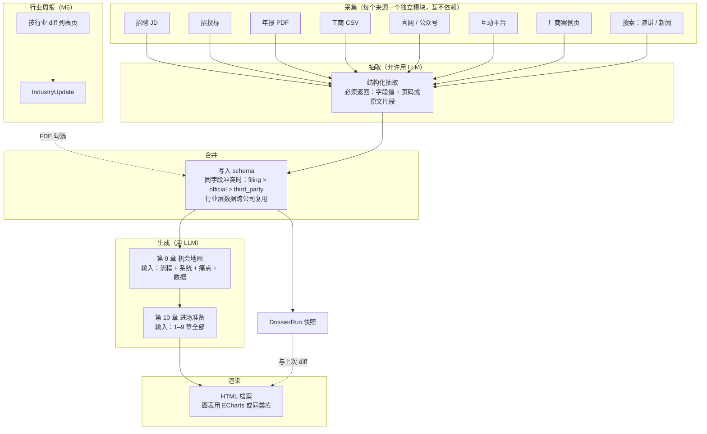

# GOAL.md · FDE 进场前客户档案系统

> 本文件是唯一的目标定义。AI coding 每次开工前先读本文件；与本文件冲突的旧代码、旧文档、旧注释一律以本文件为准。

---

## 0. 一句话目标

**输入一家目标客户 → 输出一份 FDE 进场前能读完的客户档案。** FDE 读完后要能做到：听懂客户的行话、知道客户的业务怎么跑、知道他们已经有什么系统、知道找谁谈、知道 AI 能落在哪几个环节。

这不是财报分析，不是投资研究，是**咨询公司进场前的桌面研究**，只是由系统代替人做。

---

## 1. 目标与非目标

| 做 | 不做 |
|---|---|
| 一次挖透一家客户；进场前重跑看变化 | 按公司逐个轮询、实时提醒 |
| 按行业维护一份动态周报 | 泛泛的新闻聚合 |
| 行业上下游、行业术语、业务流程 | 宏观行业研究报告 |
| 客户已有的系统、供应商、技术栈 | 估值、财务预测、投资评级 |
| 决策链、数字化推动者、阻力方 | 个人隐私、非公开信息 |
| AI 可落地的环节和前提条件 | 替 FDE 写方案 |
| 每个事实带来源链接和日期 | 多来源印证、来源信誉评分、转载检测 |
| 从法定文件、招聘、招投标等结构化来源取数 | 以搜索引擎为主要数据源 |

---

## 2. 使用流程

现有的 231 家目标客户名单（`lib/fde-roster.ts`）就是第一步的输入来源，保留。

两种更新，分开做：

| | 档案刷新 | 行业周报 |
|---|---|---|
| 粒度 | 单个客户 | 单个行业（Industry 表一行） |
| 触发 | FDE 进场前手动点 | 每周一次，或手动 |
| 做什么 | 重跑全部采集器，和上次结果 diff | 只看有列表页的来源，取新增条目 |
| 产出 | 档案顶部"自上次以来的变化"块 | 一页周报：新案例 / 新采购 / 新政策 / 目标客户新动作 |
| 阶段 | M4 | M6（M4 验收通过后才开始） |

---

## 3. 最终产物：档案结构

每章节文字上限见"文字上限"列，超出即为不合格。其余必须用图或表。

| # | 章节 | 回答 FDE 的什么问题 | 展示形式 | 文字上限 | 主要来源 |
|---|---|---|---|---|---|
| 0 | 变化块 | 自上次生成以来变了什么（仅第二次及以后生成时出现） | diff 表：新增 / 移除 / 变更，每行带来源 | 0 | 上次与本次 schema 对比 |
| 1 | 封面卡 | 这是谁、多大、干什么、最近一件大事 | 信息卡 | 50 字 | 工商、年报 |
| 2 | 行业速通 | 他们的上游是谁、下游是谁、行业里的人怎么说话、看什么指标、受什么监管 | 价值链图 + 术语表 + 行业 KPI 表 | 0 | 年报"行业情况"章节、行业协会、招股书 |
| 3 | 业务与流程 | 钱从哪来、核心业务怎么跑 | 收入结构图 + 核心流程图（每条业务线一张） | 每条业务线 1 句 | 年报分部、招股书、官网 |
| 4 | 组织与决策链 | 谁拍板、谁管 IT/数据、谁在推数字化、谁可能反对 | 组织树 + 人物表（角色列：决策/影响/使用/阻力）+ 变动时间线 | 每人 1 句 | 年报董监高、官网、招聘 JD、公开演讲 |
| 5 | 系统与数据现状 | 他们已经用了什么系统、谁供的、数据在哪、技术栈是什么 | 系统地图（按业务环节排）+ 供应商表 | 0 | 招投标、招聘 JD、供应商案例页、年报 |
| 6 | 数字化 / AI 动作 | 过去 2 年他们自己在 AI 和数字化上做了什么、说了什么 | 时间线 + 采购表 | 每条 1 句 | 招投标、募投项目、投资者互动平台、公众号、演讲 |
| 7 | 预算信号 | 有没有钱、钱往哪投 | 3 年营收/利润/研发/IT 投入柱状图 | 每指标 1 句 | 年报 |
| 8 | 同业对标 | 同行已经做了哪些 AI 案例、竞品厂商在这家客户里有没有 | 对标表 + 竞品存在表 | 0 | 同行公告、厂商案例页、招投标 |
| 9 | AI 机会地图 | 哪些环节能落 AI、痛点是什么、数据够不够、谁是业务归口 | 矩阵：业务环节 × 痛点 × 可落地场景 × 数据前提 × 归口部门 | 每格 1 句 | 由 2–8 生成 |
| 10 | 进场准备 | 见谁、按什么顺序、问什么、别踩什么 | 相关方地图 + 问题清单（≤ 10 条）+ 雷区表 + 术语速查 | 400 字 | 由 2–9 生成 |

第 9、10 章是本系统的价值所在，前 8 章是为它们准备材料。

---

## 4. 数据模型

```mermaid
erDiagram
    Company ||--o{ Position : has
    Person ||--o{ Position : holds
    Company ||--o{ OrgUnit : has
    Company ||--o{ BusinessLine : has
    BusinessLine ||--o{ ProcessStep : has
    Company ||--o{ SystemInUse : has
    Company ||--o{ Relationship : from
    Company ||--o{ FinancialSnapshot : has
    Company ||--o{ Event : has
    Company ||--o{ JobPosting : has
    Company ||--o{ Opportunity : has
    Industry ||--o{ Company : contains
    Industry ||--o{ IndustryTerm : has
    Company ||--o{ DossierRun : has
    Industry ||--o{ IndustryUpdate : has
    Source ||--o{ Fact : supports

    Company {
        string id PK "统一社会信用代码或股票代码"
        string name
        string industry_id FK
        string controller "实控人"
        string listing "A股/港股/未上市"
    }
    Industry {
        string id PK
        string name
        string upstream "上游环节列表"
        string downstream "下游环节列表"
        string kpis "行业常用指标"
        string regulators "监管方"
    }
    IndustryTerm {
        string industry_id FK
        string term
        string plain_meaning "一句人话"
        string aliases
    }
    Person {
        string id PK
        string name
        string bio "1 句"
        string stance "decider|influencer|user|blocker|unknown"
    }
    Position {
        string company_id FK
        string person_id FK
        string title
        string owns "管的业务或系统"
        date start
        date end
    }
    OrgUnit {
        string company_id FK
        string name
        string parent_id
        string head_person_id
    }
    BusinessLine {
        string company_id FK
        string name
        number revenue_share
    }
    ProcessStep {
        string business_line_id FK
        int seq
        string name
        string owner_org_unit
        string pain_point
    }
    SystemInUse {
        string company_id FK
        string category "ERP|MES|CRM|数据平台|BI|OA|其他"
        string product
        string vendor
        string covers_process_step
        date since
    }
    Relationship {
        string company_id FK
        string counterparty
        string kind "customer|supplier|it_vendor|competitor|investor"
        string amount
        date period_start
        date period_end
    }
    FinancialSnapshot {
        string company_id FK
        int year
        number revenue
        number net_profit
        number rnd_expense
        number it_capex "能找到就填"
        string fundraising_projects
    }
    Event {
        string company_id FK
        date occurred_at
        string kind "hire|leave|procurement|pilot|statement|strategy|lawsuit"
        string summary "1 句"
    }
    JobPosting {
        string company_id FK
        string org_unit
        string title
        string tech_keywords
        string system_keywords
        date posted_at
    }
    Opportunity {
        string company_id FK
        string process_step_id FK
        string pain_point
        string ai_scenario
        string data_prerequisite
        string owner_org_unit
        string confidence "high|mid|low"
    }
    DossierRun {
        string id PK
        string company_id FK
        datetime ran_at
        string snapshot "本次 schema 快照，用于 diff"
    }
    IndustryUpdate {
        string id PK
        string industry_id FK
        date found_at
        string kind "peer_case|procurement|policy|vendor_move|target_action"
        string company_id "涉及目标客户时填"
        string summary "1 句"
        string promoted_to_event_id "写入 Event 后回填"
    }
    Source {
        string id PK
        string url
        string type "filing|official|third_party"
        date published_at
        string fingerprint
        string page_or_excerpt
    }
    Fact {
        string source_id FK
        string table
        string row_id
        string field
    }
```

规则：任何写入上述表的字段，都必须在 `Fact` 里有一条对应的 `Source`。`Opportunity` 表是生成的，来源指向它所依据的 `ProcessStep` / `SystemInUse` / `Event` 行。

`Industry` 和 `IndustryTerm` 跨公司复用：同行业第二家客户直接继承，只补差异。

`DossierRun` 每次生成档案存一份快照，第 0 章的变化块由相邻两次快照 diff 得到。`IndustryUpdate` 是周报条目，FDE 判断有价值的一键写入对应客户的 `Event`，下次生成档案自动带上。

---

## 5. 数据来源与采集器

| 优先级 | 来源 | 填哪些章节 | 获取方式 | 备注 |
|---|---|---|---|---|
| P0 | 招聘 JD | 4, 5, 9 | 官网招聘页、招聘平台公开页 | 系统名、技术栈、部门设置最直接的来源；对 FDE 价值最高 |
| P0 | 招投标 / 政府采购公告 | 5, 6, 8 | 公共资源交易平台、中国政府采购网、企业自建采购平台 | 能直接读出 ERP/MES/数据平台是谁供的 |
| P0 | 年报 / 招股书 PDF | 1, 2, 3, 4, 7 | 巨潮资讯、港交所披露易 | 重点章节：行业情况、主营业务、分部、募投项目、董监高 |
| P1 | 工商数据 | 1, 4 | 第一版人工导出 CSV 导入 | 不自建爬虫 |
| P1 | 官网 + 官方公众号 | 3, 4, 6 | 抓"关于我们 / 管理团队 / 案例 / 新闻" | 官方自述，直接采信 |
| P1 | 投资者互动平台（互动易、上证 e 互动） | 6 | 抓该公司回答中含"数字化 / AI / 大模型 / 智能" 的条目 | 上市公司在 AI 上的官方表态几乎都在这 |
| P1 | IT 厂商案例页 | 5, 8 | 在主流 ERP/MES/云厂商官网搜客户名 | 反向确认系统现状 |
| P2 | 公开演讲 / 访谈（CIO、CTO、CDO） | 4, 6 | 搜索通道，只查近 2 年 | 判断谁在推、推什么 |
| P2 | 同行公告与案例 | 8 | 同行业年报、厂商案例 | 复用 `Industry` |
| P2 | 新闻 | 6 | 现有搜索通道 | 只查近 12 个月 |
| P3 | 专利、裁判文书 | 6 | 后续 | 暂不做 |

行业周报（M6）只用其中**有列表页、可以按时间 diff** 的来源：

| 来源 | 列表页 | 周报条目类型 |
|---|---|---|
| 招投标 / 政府采购 | 按行业关键词 + 目标客户名的搜索结果页 | procurement / target_action |
| 投资者互动平台 | 按行业内公司的回答列表 | target_action |
| 同行公告 | 交易所公告列表，按行业内公司 | peer_case |
| 政策发布 | 主管部门官网"通知公告"页 | policy |
| 厂商案例页 | 主流 ERP/MES/云厂商案例列表 | vendor_move / peer_case |

不用搜索引擎做周报。

---

## 6. 处理流程

---

## 7. 来源可信度

只有三档，不再细分：

| 类型 | 含义 | 例子 | 处理 |
|---|---|---|---|
| filing | 法定披露 | 年报、招股书、交易所公告、工商登记、招投标公告、互动平台回答 | 直接采信 |
| official | 公司自己说的 | 官网、招聘 JD、官方公众号、高管公开演讲 | 直接采信，档案上标"公司自述" |
| third_party | 别人说的 | 新闻、研报、厂商案例页、自媒体 | 档案上标来源名 |

组织、系统、技术栈类信息，`official` 与 `filing` 同等可信。招聘 JD 里写的系统名就是该公司在用的系统，不需要再印证。

---

## 8. 与现有代码的关系

| 处理 | 模块 | 原因 |
|---|---|---|
| **保留** | 抓取安全检查（私网拦截、重定向检查、体积限制） | 直接复用 |
| **保留** | 正文指纹、去重 | 作为 `Source.fingerprint` |
| **保留** | SQLite + Next.js 单容器 + Nginx + Basic Auth | 部署结构不变 |
| **保留** | 搜索 provider 适配层 | 只在 P2 采集器里用 |
| **保留** | PDF 抓取 | 年报解析器的输入端 |
| **保留并改用途** | `lib/fde-roster.ts` 231 家名单 | 作为目标客户名单，是输入，不是监控集 |
| **保留并改用途** | `lib/ontology.ts` 里的上下游关系定义 | 迁入 `Industry.upstream/downstream`，其余不用 |
| **冻结** | 术语纠错表、编辑距离纠错 | 用信用代码/股票代码做主键后不需要 |
| **冻结** | bigram 实体消歧 | 同上 |
| **冻结** | 转载检测、来源分级、覆盖率口径 | 数据源换成法定文件后问题消失 |
| **冻结** | 跨查询关系图、主张指纹复用 | 不再有"查询"概念，只有"客户" |
| **冻结，M6 时复用** | 调度器、监控集 | 现在不动；M6 从这里起步，改成按行业 + diff 列表页 |
| **冻结** | 现有报告链路 | 由第 3 节的新档案替代 |

"冻结"= 不删除、不修改、不在新代码中 import。新代码放独立目录，见第 11 节。

---

## 9. 施工阶段

每阶段一个 PR。每阶段验收都是"和 FDE 手写档案比"，不是单元测试全绿。

```mermaid
gantt
    title 施工阶段
    dateFormat  X
    axisFormat  %s
    section 基准
    M0 FDE 手写 3 家客户的档案（不写代码）     :m0, 0, 1
    section 数据
    M1 招聘 JD + 招投标采集器                :m1, after m0, 2
    M2 年报 PDF 解析器（含行业章节）          :m2, after m1, 2
    M3 工商 CSV + 官网 + 互动平台             :m3, after m2, 1
    section 产出
    M4 机会地图 + 进场准备 + 档案渲染 + 刷新 diff :m4, after m3, 2
    M5 厂商案例页 + 同业对标 + 搜索           :m5, after m4, 1
    section 更新
    M6 行业周报                              :m6, after m5, 2
```

| 阶段 | 输入 | 输出 | 验收 |
|---|---|---|---|
| M0 | 3 家真实目标客户（最好是已经进场过的，知道答案） | `examples/dossiers/<客户>.md`，按第 3 节结构人工填写 | 一位 FDE 确认"进场前看到这个就够了" |
| M1 | 招聘页、招投标平台 | `JobPosting`、`SystemInUse`、`OrgUnit` | 对照 M0：第 4/5 章字段命中 ≥ 70% |
| M2 | 年报/招股书 PDF | `Industry`、`IndustryTerm`、`BusinessLine`、`FinancialSnapshot`、`Position` | 第 2/3/7 章命中 ≥ 80%，每条带页码 |
| M3 | 工商 CSV、官网、互动平台 | `Company`、`Person`、`Event` | 第 1/6 章命中 ≥ 80% |
| M4 | schema 全量数据 | 可打开的 HTML 档案，含第 0/9/10 章；`DossierRun` 快照与 diff | 已进场过的 FDE 核对：机会地图与实际发现重合 ≥ 60%，问题清单里 ≥ 5 条"当时就该问"；同一客户隔一周重跑，变化块能列出真实新增 |
| M5 | 厂商案例页、搜索 | `Relationship`（竞品）、同业对标表 | 第 8 章无明显遗漏 |
| M6 | 第 5 节周报来源的列表页 | `IndustryUpdate`；一页行业周报；勾选写入 `Event` | 连续 4 周，FDE 每周勾选 ≥ 3 条"有用"；写入 Event 的条目在下次档案里出现 |

M0 是所有后续验收的基准，不可跳过。选"已经进场过"的客户做 M0，是为了让 M4 有真实答案可比。

---

## 10. 硬性验收标准

| 编号 | 标准 | 检查方式 |
|---|---|---|
| A1 | 每个字段可点击跳到来源，且页码/片段正确 | 抽查 20 个字段 |
| A2 | 每章文字不超过第 3 节上限 | 渲染时自动统计，超限报错 |
| A3 | 一家上市客户从输入到档案 ≤ 15 分钟 | 计时 |
| A4 | 第 9 章每个机会都能回溯到具体的 `ProcessStep` 和 `SystemInUse` 行 | 逐条核对 |
| A5 | 第 10 章问题清单每条都指向前 8 章某个事实 | 逐条核对 |
| A6 | 同行业第二家客户，第 2 章直接复用，只补差异 | 跑同行业两家 |
| A7 | 同一家客户重跑，数值字段一致（LLM 措辞可不同） | 跑两次 diff |
| A8 | 变化块只列真实变化，不把措辞差异当变化 | 无新数据时重跑，变化块为空 |
| A9 | 周报每条带来源链接和条目类型，且不重复上周 | 连续两周对比 |

---

## 11. AI coding 工作规则

1. **不发明名词。** 只能使用第 12 节术语表里的词。需要新概念时先在术语表加一行，用普通中文词，不用比喻（不要"六道门""账本""印证""Evidence OS"之类）。
2. **命名跟着 schema 走。** 代码里的表名、类型名、文件名用第 4 节的英文名。
3. **新代码放新目录。** 采集器 `lib/collectors/<来源>.ts`，抽取 `lib/extract/`，生成 `lib/generate/`，渲染 `lib/dossier/`，schema `db/schema.sql`。不改冻结模块。
4. **没有来源不写入。** 写 schema 的函数必须同时写 `fact` 行，否则拒绝写入。
5. **展示优先图表。** 凡是列表、对比、时间、层级、流程，一律用表或图。段落文字只允许出现在第 3 节标明有上限的位置。
6. **不做通用化。** 不为"任意实体""任意维度"设计接口。只有客户和行业。
7. **M6 之前不加自动化。** 不加定时任务、监控、通知。M6 只允许每周一次的行业周报任务，不按公司轮询。
8. **LLM 抽取必须锚回原文。** 不带页码或原文片段的抽取结果视为失败。
9. **行业层数据要复用。** `Industry`、`IndustryTerm` 按行业存，不按公司存。
10. **每个采集器有 fixture 测试。** `tests/fixtures/<来源>/` 放真实样本，测试断言抽取结果。
11. **每次 PR 只做一个阶段。** PR 描述第一行写阶段编号和对应验收标准。
12. **不确定时问，不猜。** 遇到本文件没覆盖的决定，停下来问用户，不要自行扩展范围。

---

## 12. 术语表

| 词 | 含义 |
|---|---|
| FDE | 前线部署工程师，本系统的使用者，进场到客户现场做 AI 落地 |
| 客户 | 被调查的公司，主键是统一社会信用代码或股票代码 |
| 档案 | 系统最终输出的那份 HTML/PDF |
| 行业速通 | 第 2 章：上下游、术语、KPI、监管 |
| 系统地图 | 第 5 章：客户已有系统按业务环节排列的表 |
| 机会地图 | 第 9 章：业务环节 × 痛点 × AI 场景 × 数据前提的矩阵 |
| 进场准备 | 第 10 章：见谁、问什么、别踩什么 |
| 采集器 | 从一个来源取数据的模块，一个来源一个 |
| 抽取 | 把 PDF/网页内容变成 schema 字段 |
| 来源 | 一条 URL 或一份文件，带发布日期和类型 |
| 来源类型 | filing / official / third_party，见第 7 节 |
| 冻结 | 旧代码不删、不改、不 import |
| 手写档案 | M0 产出的人工基准，放 `examples/dossiers/` |
| 变化块 | 第 0 章：本次与上次档案的 diff |
| 行业周报 | M6：按行业每周一页的新增条目，来源见第 5 节 |
